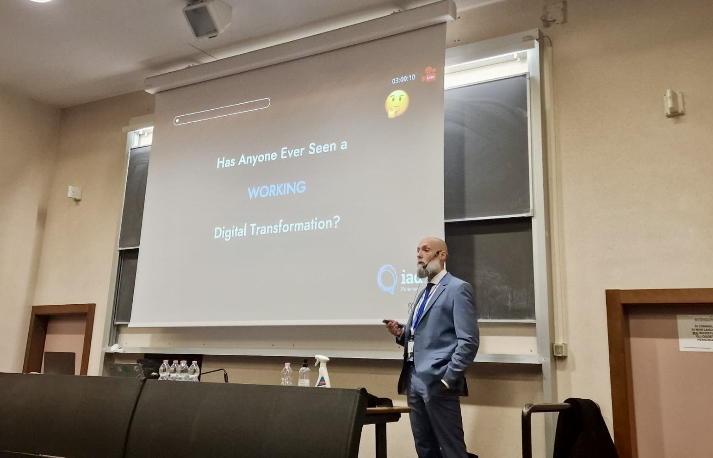

# Stop Transforming Start Evolving: My Talk at IAD24

## 🍿 Teaser

Before the talk, I set the stage with my usual [teaser](https://www.linkedin.com/pulse/ep-32-sneak-peek-italian-agile-days-2024-join-us-michele-brissoni-vshhf/?trackingId=XN49FzGSRhmFQ0RqTgIFzg%3D%3D), but this time in the [Forge of Unicorns](https://www.linkedin.com/newsletters/the-forge-of-unicorns-7184097792242458624/) newsletter in LinkedIn.

---

## 🎙️ Talk Overview - Stop Transforming Start Evolving

[🎁 Download ME - Iad24.pdf](https://github.com/undeadgrishnackh/iad24/blob/main/IAD24_StopTransformingStartEvolving.pdf)

## 🎥 Talk Recording

- Slides: [Stop Transforming Start Evolving](https://www.slideshare.net/slideshow/iad24-stop-transforming-start-evolving/273309282)
- Vimeo: [Stop Transforming Start Evolving](https://vimeo.com/1030487816)

---

## 👉 TLDR: The Conclusion

The takeaway? Digital transformation can’t be achieved by following a one-size-fits-all playbook. The key is to **stop transforming and start evolving**. Transformation isn’t about ticking off a list of tech updates; it’s about embedding sustainable, human-centered change into the DNA of your organization.

Drawing from 14 years of research and real-world applications, we’ve identified 5 common anti-patterns—from resistance to change and reliance on quick-fix consultants to underestimating the costs and human elements of transformation. Each of these obstacles requires thoughtful intervention, using behavioral engineering to design micro-behaviors that enable true evolution.

Through the [Unicorns’ Ecosystem](https://brix.consulting/services/unicorns-ecosystem/) and [Software Craftsmanship Dojo®](https://swcraftsmanshipdojo.com/) by BriX Consulting, we’re pioneering a new way forward. We’re building a continuous active-learning environment that balances technical skills with social systems—bridging craftsmanship and behavioral insights to drive lasting impact. The future of digital evolution? A socio-technical approach that advances people and technology in harmony, creating resilient organizations where transformation is not a disruptive event, but a continuous journey.

---

### 🔎 Dive Deeper

To explore the full research and insights behind the talk, check out the [Forge Of Uniconrs newsletter 📰](https://www.linkedin.com/newsletters/the-forge-of-unicorns-7184097792242458624/) and the mini-series about "Digital Transformation Disasters". The full series includes the following episodes:

- [26 - Why Digital Transformations Keep Failing at a Massive Cost. The Billion-Euro Trap](https://www.linkedin.com/pulse/ep-26-why-digital-transformations-keep-failing-massive-brissoni-eswuf/?trackingId=SUIe0KPLTA2AQo9LEcoPYQ%3D%3D&lipi=urn%3Ali%3Apage%3Ad_flagship3_pulse_read%3BrRVRZS2cT4mUm2iM3i9vTw%3D%3D)
- [27 - The Hidden Connection Between Talent Drain and Digital Transformation Failure (And How to Fix It)](https://www.linkedin.com/pulse/ep-27-hidden-connection-between-talent-drain-digital-brissoni-eb3rc/?trackingId=4M6XYoKYQlioXzQN48vL3g%3D%3D&lipi=urn%3Ali%3Apage%3Ad_flagship3_pulse_read%3BrRVRZS2cT4mUm2iM3i9vTw%3D%3D)
- [28 - Unlock the Power of OKRs and DDD to Save Your Failing Digital Transformation](https://www.linkedin.com/pulse/ep-28-unlock-power-okrs-ddd-save-your-failing-digital-brissoni-m0f2c/?trackingId=ccjNYwKiQ3icL%2F%2FFvgNeKw%3D%3D&lipi=urn%3Ali%3Apage%3Ad_flagship3_pulse_read%3BrRVRZS2cT4mUm2iM3i9vTw%3D%3D)
- [29 - Why Underestimating Digital Transformation Could Sink Your Business](https://www.linkedin.com/pulse/ep-29-why-underestimating-digital-transformation-could-brissoni-wlnqf/?trackingId=9YduYoIeTE2Ni%2BUTcHlqeg%3D%3D&lipi=urn%3Ali%3Apage%3Ad_flagship3_pulse_read%3BrRVRZS2cT4mUm2iM3i9vTw%3D%3D)
- [30 - Tech Is Only Half the Battle: How to Nail Digital Transformation with Change Management](https://www.linkedin.com/pulse/ep30-tech-only-half-battle-how-nail-digital-change-michele-brissoni-ll0af/?trackingId=5IwBRaqTRiWrIuwcHlgyIQ%3D%3D&lipi=urn%3Ali%3Apage%3Ad_flagship3_pulse_read%3BrRVRZS2cT4mUm2iM3i9vTw%3D%3D)
- [31 - Think You’ve Budgeted Enough for Digital Transformation? Think Again](https://www.linkedin.com/pulse/ep31-think-youve-budgeted-enough-digital-again-michele-brissoni-fpnyf/?trackingId=0CjPd8BtQsq0KMeiVzIdKw%3D%3D&lipi=urn%3Ali%3Apage%3Ad_flagship3_pulse_read%3BrRVRZS2cT4mUm2iM3i9vTw%3D%3D)
